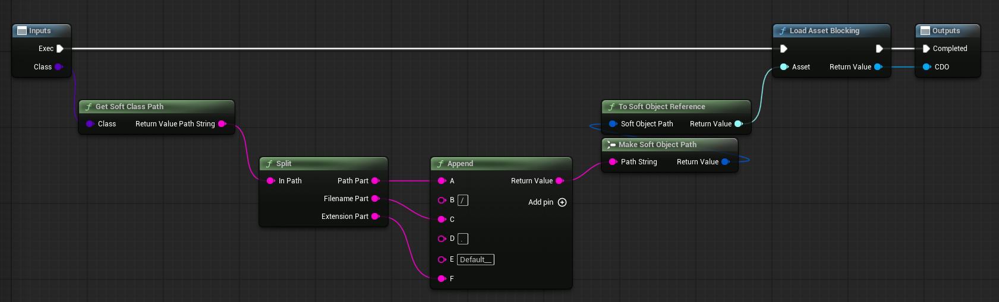
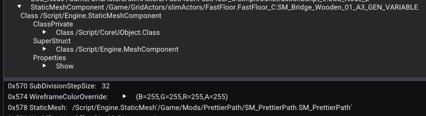
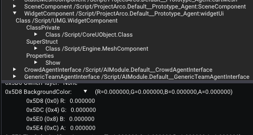
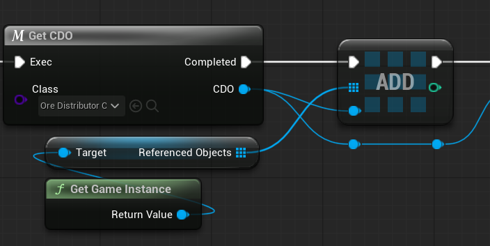

# Modding Archetypes (Class Default Objects, Component Templates & Default Subobjects)

In FModel or UE4SS you may come across default objects which serve as templates for creating new object instances. 

When Unreal creates a new `UObject` instance (usually blueprints), it needs to know what initial property values to give it. This is where archetypes come in - objects that has property values that are copied to newly created objects.

> [!NOTE]
> The following tutorials cover modifying these defaults at runtime in a blueprint mod. While you can modify these values by direct asset replacement using UAssetGUI or similar, replacing entire assets is not recommended as it's prone to breakages and conflicts with other mods touching the same asset.

## Understanding Archetypes

For more technical details, see [Unreal Source Explained: Archetype and CDO](https://github.com/donaldwuid/unreal_source_explained/blob/master/main/initialization.md#archetype-and-cdo).

### Class Default Objects (CDOs)

A Class Default Object (CDO) is the default template for all instances of a particular class. CDOs have both `RF_ClassDefaultObject` and `RF_ArchetypeObject` flags. 

You can spot a CDO by the `Default__` prefix in its name (e.g., `Default__OreDistributorConfig_BP_C`).

When you edit a CDO's property values, any new instances of that class will be created with your modified value, which makes it an extremely powerful technique for modding.

### Component Templates

Components you add via the blueprint components tab (internally called the Simple Construction Script (SCS)) each get a component template object. These templates store the property values the game has configured on those components in the editor. 

You can spot a component template because it ends with `_GEN_VARIABLE`.

Component templates also have the `RF_ArchetypeObject` flag and work similarly to CDOs - when an actor spawns, its SCS components are created using these templates. Editing a component template means all newly spawned actors will have components with your modified values.

### Default Subobjects

Components created in C++ constructors (via `CreateDefaultSubobject`) are called Default Subobjects. 

While Default Subobjects have nothing special to spot in their names, they will also have an outer of the CDO, which as you now know starts with `Default__`, plus look out for them having both `RF_DefaultSubObject` and `RF_ArchetypeObject` flags. They work similarly to component templates but are defined in native code rather than blueprints. 

## Modding Class Default Objects (CDOs)

So let's say we want to modify a property in this blueprint called `config.NonOreYield` (it's a struct property in this case, but all the same as any other type).


It's 2, so now let's change it to 100.

### Method 1

First we need to know what its parent class name is. We can see above (in FModel) that it's `/Script/SystemCore.OreDistributorConfigMule`. 

Now simply in your blueprint, ideally on the construction script (so the defaults are changed as early as possible), use the node `Get Class Defaults`, select your parent class, then tick any of the variables you want to edit:


So again as this is a struct value we want to edit, we can use the `Set members in <struct name>` node which will set only the value of that one struct property without having to break and remake the whole struct.

If we want to edit any other property type, we can use the `Set <type> (by ref)` node, e.g. any of these:


So now we can see that the `config.NonOreYield` is 100!

> [!CAUTION]
> If the value is changed but it doesn't appear to "work", it is likely that the default value of the object is being used before your mod is changing it. For example in the above example, the CDO is being used to initialise defaults in a core game system before mods are even initialised, so this change doesn't actually take effect in the game. However, if you or the game uses the CDO anytime after the mod is initialised, the changed value will be used. Please read on to the [object lifetime](#object-lifetime) section to fix this problem.

### Method 2

You can also use this method which does exactly the same thing as above but also gets a reference to the actual object.

I just have this code in a macro called `Get CDO`, but you can put this directly into the blueprint (not a function though, as `Load Asset Blocking` node is not allowed there).




Essentially all it does, is it takes the object class path (e.g. `/Game/Code/Systems/OreDistributorConfig_BP.OreDistributorConfig_BP_C`), turns it into the one with `Default__` (e.g. `/Game/Code/Systems/OreDistributorConfig_BP.Default__OreDistributorConfig_BP_C`), then loads it (with blocking means it blocks the thread from continuing until the asset is loaded - you should do this otherwise if it loads asyncronously and it takes too long, your code changing the value might won't do anything) and returns the object reference.


We use the actual object class reference, not the object's class like in method 1. So if you need to, make sure you dummy the object asset in the editor first.

Then simply cast the object reference to the object we care about, and now we have a reference to the object that we can do anything we want on, like changing values.

## Modding Component Templates

So in this blueprint (called `FastFloor_C`), I want to edit this static mesh component default value to be a reference to my own static mesh rather than the default one - in other words, I want to replace the mesh to my own.


It is especially useful to edit this value because again, this is the *template* value for when new objects are instantiated from it - meaning that after my edit, any new objects made from it will be using my mesh reference rather than the default one. Let's see how that works.

I just have this code in a macro called `Get Component Template`, but you can put this directly into the blueprint (not a function though, as `Load Asset Blocking` node is not allowed there). 


It works very similarly to how method 2 works in modding CDOs section above, but you can see it takes in the `Property Name` as input and constructs the class path of the property with `_GEN_VARIABLE` in it (e.g. `/Game/GridActors/slimActors/FastFloor.FastFloor_C:SM_Bridge_Wooden_01_A3_GEN_VARIABLE`).

And again like method 2 of above section, you will also need to dummy the object asset in your project to get the class reference.


Then just cast to the property type and do whatever it is you need to do on it. 

In this case, I cast to `StaticMeshComponent` and then call `Set Static Mesh` on it using my new mesh I have in my mod. 



Now we can see that the `GEN_VARIABLE` component template has the mod's mesh on it rather than the game's one. 

### How it looks in-game

Just so you can understand the usefulness of this technique, let's have a comparison in-game (doesn't matter on the game, just the one I'm using for this example).

Before:


After:


The reason I'm showing the fast floor (stone path) in the construction mode, is to show that since we have edited the template, when the stone path is selected for construction, the object created for construction mode is using the template.

> [!NOTE]
> The alternative solution would be the crude method of getting all actors instances in the world and modifying the mesh on each one - but this would need to be repeated every time a new actor is created in the world, which could cause a massive performance hit dependong on what is being done and how many actors are being changed.

## Modding Default Subobjects

Let's say we want to change the background color on a widget component that is a default subobject.


The asset we want to change here is called `Agent_C` and has the name `Default__Agent_C` however its parent class is the native `Prototype_Agent` so we actually want to modify that one.



It's all basically the same as before, but just noting we need the `Default__<base class name>` name format.


So now the default subobject `BackgroundColor` is modified successfully:


## Object Lifetime

If you modify an archetype that is on an asset object (i.e. not a native `/Script/` class), the value is garbage collected (GC'd) when the level changes or on other certain game instance events.

What this means is, if you modify a CDO or component template on let's say, a blueprint in the main menu of a game, then the modification is reset back to how it is set in the asset when a level is loaded - effectively revoking your modification until you do it again.

This is bad because ideally we want to keep our edits all the time. If we don't, and the mod does not load early enough before certain game systems that we need to modify defaults for, then the modifications won't do anything. 

So if we can change the defaults as early as possible on game instance initialisation (or in the main menu) and keep those modifications through level load, then the newly created objects will still use those modifications.

There is good news and bad news. The good news is, `GameInstance` has a property called `ReferencedObjects` which stores a list of hard object references that won't be GC'd. The bad news is that this property is not marked Visible or BlueprintReadWrite so we have to use some tricks to get at it.



Using one of the tricks below (depending on the engine version you are on), simply add the object to the `ReferencedObjects` array. 

I don't have it inside of the macro because it may be that sometimes you _don't_ want to persist objects you changed between levels. Though this could be a bool option on the macro, it doesn't really matter how you implement it.

> [!NOTE]
> Remember this is only the case on asset objects, not native ones, so you shouldn't need to do this when modifying archetypes on native classes.

### UE4

In UE4, simply copy and past the following kismet into your editor to get the variable:

```
Begin Object Class=/Script/BlueprintGraph.K2Node_VariableGet Name="K2Node_VariableGet_3"
   VariableReference=(MemberParent=Class'"/Script/Engine.GameInstance"',MemberName="ReferencedObjects")
   SelfContextInfo=NotSelfContext
   NodePosX=688
   NodePosY=224
   NodeGuid=CB4818F84C2F00E9C6031387C6D5EF57
End Object
```

Then connect it up to `Get Game Instance` and add your object reference to the `ReferencedObjects` array.

### UE5

Sadly in UE5, Epic "fixed" this method so you can't just do this anymore, as it will fail to compile with the error that the property is not blueprint visible. 😭

So the only way to get access to it right now, is to do an engine edit to mark it `Visible` and `BlueprintReadWrite` and build the engine change yourself. 

Hopefully in the future we will have tooling to help us modify access transformers at the project level without having to modify engine.