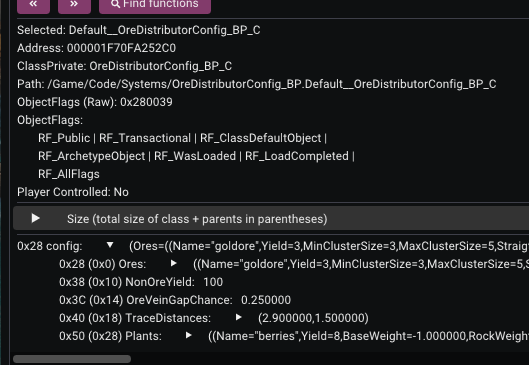
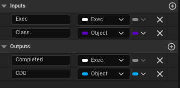
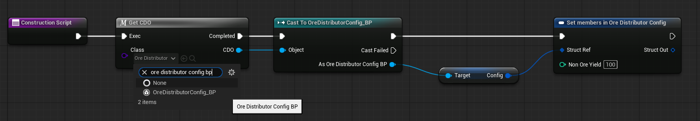
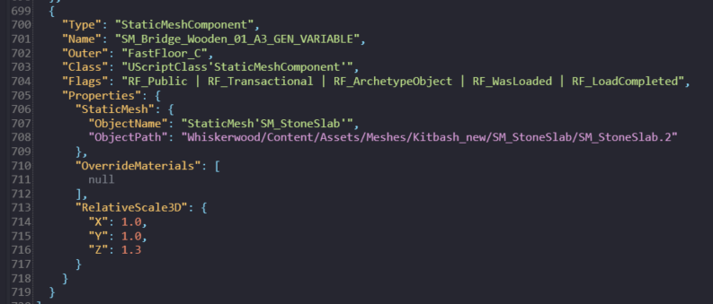
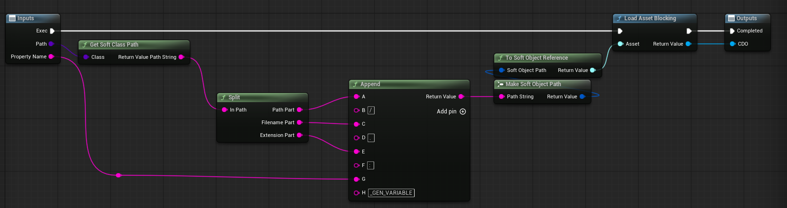
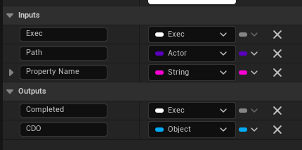

# Modding Default Objects

In FModel or UE4SS you may come across default objects which are the default values of an object (usually blueprints) which is usually marked with the flags `RF_ClassDefaultObject` & `RF_ArchetypeObject`, or of a property in the object which is usually marked with the flag `RF_ArchetypeObject`.

The Class Default Object is the default template that new instances of that class use when being created. So if you can edit this template from your mod, any new instances of that object will be created using the values you set - an extremely powerful method in your toolbox.

I can't claim to fully understand the system and the differences between a Class Default Object and an Archetype Object, but it is explained in more detail [here](https://github.com/donaldwuid/unreal_source_explained/blob/master/main/initialization.md#archetype-and-cdo) if you want to know more.

The following tutorial is specifically for modifying the defaults at runtime in a blueprint mod - yes, you can easily modify these values by direct asset replacement using UAssetGUI or similar, but replacing an entire asset is never the recommended path (prone to breakages, conflicts with other mods touching the same asset etc).

## Modding Class Default Objects (CDOs)

You can spot a CDO with the `Default__` prefixed to the name of the object, for example a blueprint called `OreDistributorConfig_BP_C` has a CDO called `Default__OreDistributorConfig_BP_C`. 

So let's say we want to modify a property in this blueprint called `config.NonOreYield` (it's a struct property in this case, but all the same as any other type).

It's 2, so now let's change it to 100.

### Method 1

First we need to know what its parent class name is. We can see above (in FModel) that it's `/Script/SystemCore.OreDistributorConfigMule`. 

Now simply in your blueprint, ideally on the construction script (so the defaults are changed as early as possible), use the node `Get Class Defaults`, select your parent class, then tick any of the variables you want to edit:

So again as this is a struct value we want to edit, we can use the `Set members in <struct name>` node which will set only the value of that one struct property without having to break and remake the whole struct.

If we want to edit any other property type, we can use the `Set <type> (by ref)` node, e.g. any of these:

So now we can see that the `config.NonOreYield` is 100!

> [!CAUTION]
> If the value is changed but it doesn't appear to "work", it is likely that the default value of the object is being used before your mod is changing it. For example in the above example, the CDO is being used to initialise defaults in a core game system before mods are even initialised, so this change doesn't actually take effect in the game. However, if you or the game uses the CDO anytime after the mod is initialised, the changed value will be used.

### Method 2

You can also use this method which does exactly the same thing as above but also gets a reference to the actual object.

I just have this code in a macro called `Get CDO`, but you can put this directly into the blueprint (not a function though, as `Load Asset Blocking` node is not allowed there).

Essentially all it does, is it takes the object class path (e.g. `/Game/Code/Systems/OreDistributorConfig_BP.OreDistributorConfig_BP_C`), turns it into the one with `Default__` (e.g. `/Game/Code/Systems/OreDistributorConfig_BP.Default__OreDistributorConfig_BP_C`), then loads it (with blocking means it blocks the thread from continuing until the asset is loaded - you should do this otherwise if it loads asyncronously and it takes too long, your code changing the value might won't do anything) and returns the object reference.

We use the actual object class reference, not the object's class like in method 1. So if you need to, make sure you dummy the object asset in the editor first.

Then simply cast the object reference to the object we care about, and now we have a reference to the default object that we can do anything we want on, like changing values.

## Modding Default Object Properties

You can spot a default object property because it ends with `_GEN_VARIABLE`.

So in this blueprint (called `FastFloor_C`), I want to edit this static mesh component default value to be a reference to my own static mesh rather than the default one - in other words, I want to replace the mesh to my own.

It is especially useful to edit this value because again, this is the *template* value for when new objects are instantiated from it - meaning that after my edit, any new objects made from it will be using my mesh reference rather than the default one. Let's see how that works.

I just have this code in a macro called `Get Property CDO`, but you can put this directly into the blueprint (not a function though, as `Load Asset Blocking` node is not allowed there). 

It works very similarly to how method 2 works in modding CDOs section above, but you can see it takes in the `Property Name` as input and constructs the class path of the property with `_GEN_VARIABLE` in it (e.g. `/Game/GridActors/slimActors/FastFloor.FastFloor_C:SM_Bridge_Wooden_01_A3_GEN_VARIABLE`).

And again like method 2 of above section, you will also need to dummy the object asset in your project to get the class reference.

Then just cast to the property type and do whatever it is you need to do on it. 

In this case, I cast to `StaticMeshComponent` and then call `Set Static Mesh` on it using my new mesh I have in my mod. 

Now we can see that the `GEN_VARIABLE` default object has the mod's mesh on it rather than the game's one. 

### How it looks in-game

Just so you can understand the usefulness of this technique, let's have a comparison in-game (doesn't matter on the game, just the one I'm using for this example).

Before:

After:

The reason I'm showing the fast floor (stone path) in the construction mode, is to show that since we have edited the template, when the stone path is selected for construction, the object created for construction mode is using the template.

> [!NOTE]
> The alternative solution would be the crude method of getting all actors instances in the world and modifying the mesh on each one - but this would need to be repeated every time a new actor is created in the world, which could cause a massive performance hit dependong on what is being done and how many actors are being changed.